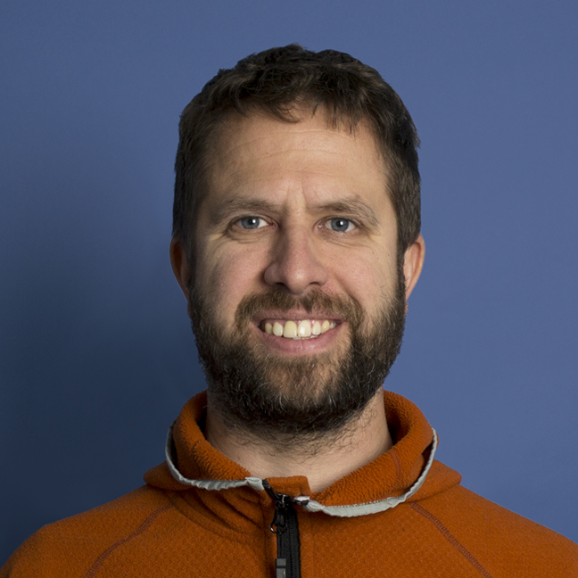

# Markus Frauenfelder
Software Architect, Requirements Engineer, Senior Software Engineer.

<a href="frmarkus@gmail.com">frmarkus@gmail.com</a>
| <a href="https://github.com/frmarkus/markdown-cv/blob/gh-pages/index.md">This CV.</a>

## Markus Frauenfelder

`Birth Date` 08.05.1976

`Origin` Henggart (ZH), Niederglatt (ZH)

`Address` Route des Fruitiers 23

`.` 1745 Lentigny

`Mobile` +41 78 676 64 04

## Current Occupation, Netcetera AG

`04.2021 - Today`
__Requirements Engineer, Senior Software Engineer, Architect__

* Technical requirements engineering for a credit card issuer in the context of its mobile wallet.
* Architecture, coordination and implementation support of security critical features for a credit card issuer in the context of its mobile wallet.
* `Tools` PlantUml, Jira, Confluence, Java, Spring Boot, k8s, Rancher.

`09.2015 - 04.2021`
__Senior Software Engineer, Architect__

* *Backend*
  * Implementations on different solutions for a credit card issuer in the context of its mobile wallet.
  * Implementation of a backend integration solution to connect a mobile wallet backend with a credit card issuer backend.
  * `Tools` Java, Spring Boot, Jira, Confluence.
* *Android*
  * Implementation of a mobile wallet on Android.
  * Architecture, coordination and implementation of big changes on an existing Android banking implementation.
  * Architecture, coordination and implementation of a very secure Android library for contactless payment through NFC.
  * Evaluation of application security toolchains for Android and iOs.
  * `Tools` Java, Android, Security Toolchains (Digital.ai / Arxan, Inside Secure / Metaforic)

* Colaboration on the development of a big JEE application for the calculation of the national railroad schedule on client and server.

`07.2017 - today`
__Teamleader__

* Leader of a team of up to seven software engineers in a matrix organization.
* Execution of technical interviews with junior and senior software engineers.

### Specialized in

Requirements Engineering, Architecture and Implementation of complex backend systems.

## Prior Occupations

`01.2015 – 08.2015`
__Senior Software Engineer and Architect at Haag-Streit Diagnostics, Koeniz__

* Collaboration on the implementation of a new JavaFX fat clients for biometric eye examination.
* Development and implementation of an abstraction framework for a strict separation between front end and backend of the fat client.
* Development and implementation of an IPC framework to connect java, python, C++ and LabView.
* Collaboration on the conceptual redesign of the UI suite of Haag-Streit.
* Introduction of: git, gradle, jpa as replacements of svn, ant, jdbc.
* Introduction of the dependency injection frameworks 'dagger'.
* `Tools` java, javaFX, git, gradle, jenkins

`04.2006 - 12.2014`
__Senior Software Engineer, Architect, Project Manager at Ergon Informatik, Zuerich__

* Backend Software Engineering
* Mobile Solutions Software Engineering
* Embedded Systems Software Engineering
* Project Management

`09.2000 - 09.2001`
__Programmer, Analyst at DaimlerChrysler Schweiz AG, Schlieren__

* Consulting and support of tech related business issues.
* Support data processing center on issues with productive systems.
* Lead of complete development cycles of small to medium projects.
* `Tools` Mainframe (OS390), Cobol74, Adabas

`04.1998 - 04.2000` 
__Programmer, Analyst at Winterthur Versicherungen, Winterthur__

* Software Engineering.
* Analysis of requirements.
* Database design.
* Intranet section responsible incl. employee education.
* `Tools` Mainframe (MVS), DB2, IMS, PL/1, SQL, JCL.

## Continuing Education

`2022` 3DS Introduction

`2022` Payments 101

`2021` SAFe Basics in-house course

`2020` Container and Kubernetes Basics

`2019` Core Spring Course

`2018` ch-Open Workshop days: 'End-to-End Continuous Delivery on kubernetes', 'Line Coverage is dead, the Hunt for Mutation is open'.

`2018` Jazoon Bern `DevOps for Devs'.

`2017` UL Mobile Payments Masterclass by ul.com

`2016` Betriebssanitaeter

`2016` 'Extreme Java' Inhouse course by JavaSpecialists.eu

`2016` Self study of Kotlin for the implementation of a small time tracking application.

`2015` Intense self studies of gradle as buildtool for Java- and C++-Projects.

`2014` Interne Course: Usability and User Experience.

`2013` Application Security Basic by Protect7.

`2011` Cross-Platform Mobile Web Application Development Training by Adrian Kosmaczewski.

`2008` 'Swiftwater Rescue Technician Unit 1' von 'Rescue 3'.

`2008` J&S Course: White Water Kayaking.

`2008` Brevet 1 of the 'Schweizerischen Lebensrettungsgesellschaft'.

`11.2007 -- 02.2008` Projectmanager SGO.

`04.2006 -- 12.2014` Multiple intern courses: git, Google Web Toolkit, Android, Test Driven Development.

`2001` Diverse SAP Courses

`2000` 5 Weeks intern education at 'Winterthur Versicherung'.

`1999` Attendance of a BEC3 (Business English Certificate) course.

`1999` 5 Weeks intern education at 'Winterthur Versicherung': 'Online programmer with PL1 and IMS-DC.

`02.1997 -- 03.1997` 6 Weeks english language education in canada out of which 4 weeks intense enlish courses.

## Education

`10.2001 – 03.2006`
__Studies of Computer Sciences at ETH Zurich__

* Major: __Software Engineering__
  * Master Thesis: Implementation of a Bytecode Verifier for the .NET CLR. (C#)
  * Semester Thesis: 'Transposal of different graphical network representations into each other. (C++)'
* Minor: __Biomechanik__
  * Semester Thesis: Development and implementation of an Algorithm for the elimination of Dedicated Marker Erasures on Gait Analysis. (LabView)

`10.1997 – 04.1998` __Basic Computer Science School at Winterthur Versicherung__

`08.1991 – 01.1996` __Kantonsschule in B¨ulach (mathematics, natural sciences)__

## Languages

`German` Mother Tongue

`English` Fluent in Word and text

`French` Fluent in Word

* Spoken

## Private Interest

`Current`

* Gravity Mountain Biking
* Skiing (Alpine, Telemark, Backcountry)
* Family

`Past`
* 2008 - 2020 White Water Kayak Instructor. (ASVZ)

<!-- ### Footer
Last updated: April 2023 -->
